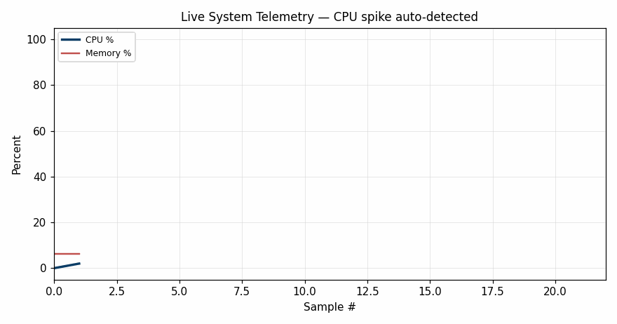
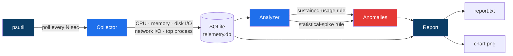

<div align="center">

# 🖥️ System Telemetry & Performance Analyzer

[](https://git.io/typing-svg)


**Watches a machine's vitals, catches anomalies as they happen, and tells you what to do about them.**

</div>

---

## 🎬 Live demo — real data, not staged

This GIF is built frame-by-frame from an actual collector run. I deliberately spun up
a background CPU-bound process and let the tool catch it on its own:

<div align="center">

</div>

Watch the red dots appear the instant CPU crosses the sustained-usage threshold — that's
the anomaly detector firing in real time, not an animation added after the fact.

---

## 📐 How it fits together



---

## ✨ What it does

| | |
|---|---|
| 📡 **Collects** | CPU, memory, disk I/O, network I/O, and the top CPU-consuming process every N seconds, straight into SQLite. |
| 🔴 **Sustained-usage detection** | CPU/memory stays above threshold for 3+ consecutive samples — filters out momentary blips. |
| 🟠 **Statistical-spike detection** | A disk/network sample jumps > 2.5 standard deviations above its trailing rolling average. |
| 📊 **Reports** | Plain-text summary + a matplotlib chart with anomalies marked directly on the timeline. |
| 💡 **Suggests fixes** | Optimization suggestions based on which anomalies fired — e.g. "check for busy-polling loops" when CPU is sustained-high. |

---

## 🚀 Quick start

```bash
pip install -r requirements.txt
python src/main.py --duration 60 --interval 2
```

Outputs land in `reports/report.txt` and `reports/telemetry_chart.png`.

<details>
<summary><b>▶ Click to see a real sample report</b></summary>

```
============================================================
SYSTEM TELEMETRY & PERFORMANCE REPORT
============================================================
Samples analyzed : 23
Avg CPU / Max CPU: 34.9% / 100.0%
Avg Mem / Max Mem: 6.3% / 6.3%

Anomalies detected: 2
  - [sustained_cpu] CPU >= 80.0% for 8 consecutive samples
  - [spike_disk] Disk I/O spike: 0.09 MB vs trailing 10-sample average

Top CPU-consuming processes (by # samples as top process):
  - python3: 14 samples

Suggested optimizations:
  * Sustained high CPU detected — investigate the top-offending process for
    busy-polling loops or missing backoff/sleep in hot paths.
  * 1 disk I/O spike(s) detected — consider batching writes or checking for
    unexpected background sync/indexing activity.
============================================================
```

</details>

<details>
<summary><b>▶ Why cross-platform (psutil) instead of Windows-only APIs?</b></summary>
<br>

Built deliberately on psutil's public API surface (`cpu_percent`, `virtual_memory`,
`disk_io_counters`, `net_io_counters`, `process_iter`) rather than `pywin32`/`wmi`, so
the exact same code runs unmodified on Windows, Linux, or macOS — same collection
approach used for device telemetry, without locking the tool to one OS.

</details>

<details>
<summary><b>▶ Why two anomaly rules instead of one threshold?</b></summary>
<br>

A single instantaneous threshold triggers on momentary blips (a process launching,
a brief GC pause) and drowns real signal in noise. Requiring a **sustained run** of
samples above threshold catches genuine pressure; a separate **statistical-spike**
rule (rolling mean + std. dev.) catches sudden burst-type anomalies like disk I/O —
two different failure shapes need two different detectors.

</details>

---

## 🗂️ Project layout

```
telemetry-analyzer/
├── src/
│   ├── collector.py   # polls psutil, writes to SQLite
│   ├── analyzer.py    # sustained-usage + statistical-spike anomaly detection
│   ├── report.py      # text report + matplotlib chart
│   └── main.py        # CLI entrypoint
├── data/               # telemetry.db (gitignored)
├── reports/            # generated report.txt, chart.png, demo.gif
└── requirements.txt
```

## 🧭 Possible extensions

- Export to Windows Performance Recorder (WPR) / ETW-style trace format
- Per-core CPU breakdown instead of aggregate
- Configurable thresholds via a config file
- Web dashboard instead of a static PNG report

---

<div align="center">

Built by **[Shaik Mohammed Umar](https://github.com/shaikumar11)** ·
[Portfolio](https://mohammedumar.netlify.app) ·
[LinkedIn](https://linkedin.com/in/mohammed-umarshaik)

</div>
